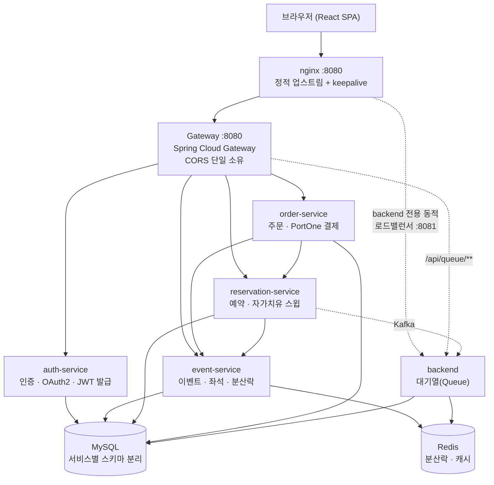

# 픽시트 (PickSeat)

콘서트 등 한정 좌석에 다수 사용자가 한꺼번에 몰리는 상황을 가정한 **선착순 이벤트 티켓팅 서비스**입니다.
MSA·트래픽 처리 경험을 쌓기 위한 개인 프로젝트로, 단일 모놀리스로 시작해 **동시성 제어 → 수평 확장 → 5단계
마이크로서비스 분리**까지 직접 겪으며 확장했습니다. 모든 설계 변경은 추측이 아니라 k6 부하테스트로 전후 수치를
비교해 검증했습니다.

> 이 프로젝트가 어떤 과정을 거쳐 지금 구조에 이르렀는지는 [`docs/`](./docs) 폴더의 기획 문서를 참고하세요.

## 아키텍처



**입구는 nginx 하나뿐입니다.** nginx가 Gateway로 가는 경로는 고정 IP + 커넥션 풀링(`keepalive`)으로 연결하고,
수평 확장되는 `backend`로 가는 경로만 별도 포트(8081)에서 동적 DNS resolver로 매 요청마다 살아있는 레플리카를
다시 찾습니다 — 이렇게 나눈 이유는 [부하테스트 결과](#부하테스트로-검증한-것들)에 있습니다. CORS는 Gateway
한 곳에서만 처리합니다(개별 서비스가 각자 CORS를 설정하면 헤더가 중복으로 붙어 브라우저가 응답을 거부합니다).

## 서비스 구성

| 서비스 | 역할 | 비고 |
|---|---|---|
| `gateway` | 단일 진입점, 라우팅, CORS | Spring Cloud Gateway (함수형 `RouterFunction` 기반) |
| `auth-service` | 회원가입/로그인, 이메일 인증, OAuth2(Google/Kakao), JWT 발급 | JWT를 **발급**하는 유일한 서비스 |
| `event-service` | 이벤트/좌석 조회, 좌석 홀드 | Redis(Redisson) 분산락으로 동시 홀드 방지 |
| `reservation-service` | 좌석 예약, 예약 확정/취소 | 홀드 만료를 스스로 정리하는 자가치유 스윕 보유 |
| `order-service` | 주문 생성, PortOne 결제/환불 | 결제 실패 시 예약 자동 취소(saga) |
| `backend` | 대기열(Queue) 입장/상태 조회 | 3개 레플리카로 수평 확장되는 유일한 서비스 |
| `nginx` | 외부 진입점, 내부 로드밸런서 | `backend` 전용 동적 로드밸런싱 포트(8081) 별도 운영 |
| `mysql` / `redis` / `kafka` | 데이터 저장소 · 메시징 | 서비스마다 스키마(`ticketing_auth`, `ticketing_event` 등) 분리 |

각 서비스는 자신의 DB 스키마만 소유하며, 서비스 간 참조는 전부 `Long` id + 전용 REST 클라이언트로 이뤄집니다.
JWT는 auth-service만 발급하고, 나머지 서비스는 같은 시크릿으로 검증만 합니다.

## 핵심 기능

**인증**
- 이메일 회원가입(비밀번호 대/소문자·숫자·특수문자 포함 정책 + 실시간 강도 표시) + 이메일 인증
- Google / Kakao OAuth2 소셜 로그인
- JWT 액세스/리프레시 토큰, 프로필 수정, 비밀번호 변경(소셜 로그인 계정은 차단)

**이벤트/좌석**
- 이벤트 목록 검색(제목 키워드) · 상태 필터 · 공연일 정렬 · 페이지네이션
- Redisson 분산락으로 동일 좌석 동시 홀드 방지

**예약/주문/결제**
- 좌석 임시 홀드 → 예약 → 결제 흐름, PortOne 연동 결제/환불
- 결제 실패 시 예약 자동 취소, 홀드 만료 자동 정리(이벤트 서비스·예약 서비스가 각자 독립적으로 스윕 — 한쪽이
  죽어도 다른 쪽이 커버)
- **동시 예약 30건 부하테스트로 오버셀(중복 판매) 0건을 반복 검증**

**대기열**
- 선착순 입장 대기열, 수평 확장된 `backend` 전체에 고르게 분산(아래 부하테스트 참고)

**프론트엔드**
- 404 페이지 / 에러 바운더리 / 로딩 스켈레톤 / 토스트 알림
- 예약·주문 취소, 로그아웃 확인 다이얼로그
- 마이페이지(이름 변경, 비밀번호 변경)

## 부하테스트로 검증한 것들

설계가 "될 것 같다"가 아니라 "작동한다"는 걸 k6(1000 VU 기준) 부하테스트로 직접 증명했습니다.

| 검증 항목 | 이전 | 이후 |
|---|---|---|
| 서비스 분리(4차) 후 예약 API 지연(p95) | 122ms | 139ms (홉 1개 추가, 허용 범위로 판단) |
| 대규모 동시 요청 시 실패율 | 24% | **0.05%** (nginx 임시 포트 고갈 → 정적 업스트림+keepalive로 해결) |
| `backend` 3레플리카 요청 분산(30건 기준) | 30 : 0 : 0 (전혀 분산 안 됨) | 9 : 10 : 11 (내부 동적 로드밸런서 추가 후) |
| 좌석 중복 예약 | - | 30건 동시 요청에도 0건 |
| 부하테스트 중 발견한 설계 결함 | 취소된 좌석 1,003/5,460석이 영구 재예약 불가 | DB 유니크 제약 수정으로 전부 복구 |

자세한 과정은 [`docs/`](./docs)와 커밋 로그(`nginx 시작 안정성 + backend 로드밸런싱 수정`,
`nginx 커넥션 재사용 + 좌석 영구 재예약 불가 버그 수정` 등)에 남아 있습니다.

## 기술 스택

| 영역 | 스택 |
|---|---|
| Backend | Java 17, Spring Boot 4.1, Spring Security 7, Spring Data JPA, Spring Cloud Gateway(WebMVC), Gradle |
| Frontend | React 19, TypeScript, Vite, react-router-dom v7, axios |
| 메시징/캐시 | Kafka, Redis 7 (Redisson 분산락) |
| DB | MySQL 8 (서비스별 스키마 분리) |
| 결제 | PortOne (테스트 연동) |
| 인프라(local) | Docker Compose, nginx |
| 부하테스트 | k6 |

## 프로젝트 구조

```
ticketing-service/
├─ gateway/               # API Gateway (라우팅 + CORS)
├─ auth-service/          # 인증 · OAuth2 · JWT 발급
├─ event-service/         # 이벤트 · 좌석 · 분산락
├─ reservation-service/   # 예약 · 자가치유 스윕
├─ order-service/         # 주문 · PortOne 결제
├─ backend/               # 대기열(Queue), 수평 확장 대상
├─ nginx/                 # 외부 진입점 + backend 내부 로드밸런서 설정
├─ frontend/              # React SPA (일반 사용자용, :5173)
├─ admin-frontend/        # React SPA (관리자 전용, :5174 — 일반 사이트와 origin/토큰/로그인 분리)
├─ loadtest/              # k6 부하테스트 스크립트
├─ docs/                  # 요구사항/엔티티/API 기획 문서
└─ docker-compose.yml     # 로컬 전체 스택 기동
```

## 로컬 실행 방법

### 1. 환경변수 준비

```bash
cp .env.example .env
```

`.env`에 Google/Kakao OAuth 클라이언트, Gmail SMTP(이메일 인증용), PortOne 테스트 키, `JWT_SECRET`을 채워주세요.
전부 비워둬도 회원가입/로그인 자체는 로컬 이메일·비밀번호 방식으로 동작합니다.

### 2. 전체 스택 기동

Docker Desktop을 실행한 뒤:

```bash
docker compose up -d
```

MySQL, Redis, Kafka, nginx, gateway와 5개 마이크로서비스가 한 번에 올라옵니다. 진입점은 **nginx 하나**입니다.

- API: `http://localhost:8080` (nginx → gateway → 각 서비스)
- MySQL: `localhost:3306` / Redis: `localhost:6379`

개별 서비스 로그 확인:

```bash
docker compose logs -f gateway reservation-service
```

### 3. 프론트엔드 실행

```bash
cd frontend
npm install
npm run dev
```

`http://localhost:5173`에서 확인 가능하며, `frontend/.env`의 `VITE_API_BASE_URL`로 백엔드(nginx) 주소를 지정합니다.

### 4. 관리자 앱 실행 (선택)

```bash
cd admin-frontend
npm install
npm run dev
```

`http://localhost:5174`에서 열립니다. 관리자는 일반 사이트(5173)에 로그인할 수 없고, 이 앱의 전용 로그인(`POST /api/auth/admin/login`, 세션 15분, 소셜 로그인 불가)으로만 들어옵니다. 관리자 계정은 가입 후 DB에서 `UPDATE users SET role='ADMIN' WHERE email='...'`로 승격합니다.

### 5. 부하테스트 (선택)

```bash
docker run --network ticketing-service_default --ulimit nofile=200000:200000 \
  -v "$(pwd)/loadtest:/scripts" grafana/k6 run /scripts/reserve_flow.js
```

## API 게이트웨이 라우팅

| 경로 | 대상 서비스 |
|---|---|
| `/api/auth/**`, `/oauth2/**`, `/login/oauth2/**` | auth-service |
| `/api/events/**` | event-service |
| `/api/reservations/**` | reservation-service |
| `/api/orders/**` | order-service |
| `/api/queue/**` | backend (nginx 내부 로드밸런서 경유) |

## 문서

- [`docs/`](./docs) — 요구사항 정의서, 엔티티 설계서, API 명세서, OAuth2 설정 정리
