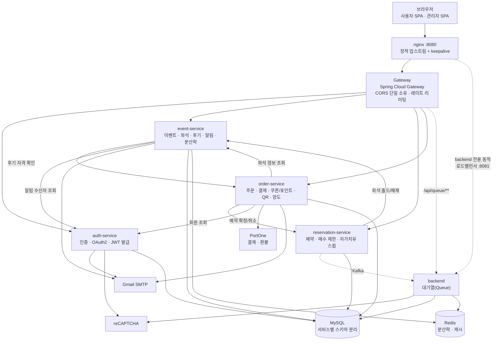

# 픽시트 (PickSeat)

콘서트 등 한정 좌석에 다수 사용자가 한꺼번에 몰리는 상황을 가정한 **선착순 이벤트 티켓팅 서비스**입니다.
MSA·트래픽 처리 경험을 쌓기 위한 개인 프로젝트로, 단일 모놀리스로 시작해 **동시성 제어 → 수평 확장 → 5단계
마이크로서비스 분리**까지 직접 겪으며 확장했습니다. 모든 설계 변경은 추측이 아니라 k6 부하테스트로 전후 수치를
비교해 검증했습니다.

이후에는 "예매가 되는 서비스"에서 **"실제로 운영할 수 있는 서비스"** 로 넓혔습니다. 입장 QR, 쿠폰·포인트, 단계별 환불,
티켓 양도, 알림, 관리자 도구, 봇 방어를 기능 단위 브랜치와 PR로 하나씩 더하고, 동시성이 걸리는 부분은 통합 테스트로
검증했습니다.

> 이 프로젝트가 어떤 과정을 거쳐 지금 구조에 이르렀는지는 [`docs/`](./docs) 폴더의 기획 문서를 참고하세요.

## 목차

[아키텍처](#아키텍처) · [서비스 구성](#서비스-구성) · [핵심 기능](#핵심-기능) · [설계 포인트](#설계-포인트) ·
[부하테스트](#부하테스트로-검증한-것들) · [테스트](#테스트) · [기술 스택](#기술-스택) · [프로젝트 구조](#프로젝트-구조) ·
[로컬 실행](#로컬-실행-방법) · [봇 방어](#봇-방어-레이트-리미팅) · [게이트웨이 라우팅](#api-게이트웨이-라우팅) ·
[알려진 한계](#알려진-한계)

## 아키텍처



**입구는 nginx 하나뿐입니다.** nginx가 Gateway로 가는 경로는 고정 IP + 커넥션 풀링(`keepalive`)으로 연결하고,
수평 확장되는 `backend`로 가는 경로만 별도 포트(8081)에서 동적 DNS resolver로 매 요청마다 살아있는 레플리카를
다시 찾습니다 — 이렇게 나눈 이유는 [부하테스트 결과](#부하테스트로-검증한-것들)에 있습니다. CORS는 Gateway
한 곳에서만 처리합니다(개별 서비스가 각자 CORS를 설정하면 헤더가 중복으로 붙어 브라우저가 응답을 거부합니다).

## 서비스 구성

| 서비스 | 역할 | 비고 |
|---|---|---|
| `gateway` | 단일 진입점, 라우팅, CORS, IP별 레이트 리미팅 | Spring Cloud Gateway (함수형 `RouterFunction` 기반) |
| `auth-service` | 회원가입/로그인, 이메일 인증, OAuth2(Google/Kakao), 관리자 로그인, 알림 수신 설정, JWT 발급 | JWT를 **발급**하는 유일한 서비스 |
| `event-service` | 이벤트/좌석, 장르·캘린더 조회, 찜·후기, 오픈/취소표 알림, 관리자 공연·좌석 관리 | Redis(Redisson) 분산락으로 동시 홀드 방지 |
| `reservation-service` | 좌석 예약, 예약 확정/취소, 공연당 매수 제한 | 홀드 만료를 스스로 정리하는 자가치유 스윕 보유 |
| `order-service` | 주문, PortOne 결제/단계별 환불, 쿠폰·포인트, QR 입장권, 티켓 양도, 구매자 확인, 관리자 매출 집계 | 결제 실패 시 예약 자동 취소(saga) |
| `backend` | 대기열(Queue) 입장/상태 조회 | 3개 레플리카로 수평 확장되는 유일한 서비스 |
| `nginx` | 외부 진입점, 내부 로드밸런서 | `backend` 전용 동적 로드밸런싱 포트(8081) 별도 운영 |
| `mysql` / `redis` / `kafka` | 데이터 저장소 · 메시징 | 서비스마다 스키마(`ticketing_auth`, `ticketing_event` 등) 분리 |

각 서비스는 자신의 DB 스키마만 소유하며, 서비스 간 참조는 전부 `Long` id + 전용 REST 클라이언트로 이뤄집니다.
JWT는 auth-service만 발급하고(`sub`, `email`, `role` 클레임), 나머지 서비스는 같은 시크릿으로 검증만 하며 `role`을
`ROLE_USER` / `ROLE_ADMIN` 권한으로 바꿉니다. 권한 검사는 서비스별 `SecurityConfig`의 URL 매처(`hasRole("ADMIN")`)로 합니다.

## 핵심 기능

**인증 · 계정**
- 이메일 회원가입(비밀번호 대/소문자·숫자·특수문자 포함 정책 + 실시간 강도 표시) + 이메일 인증
  - 인증 메일은 가입 트랜잭션이 커밋된 뒤 비동기로 발송(가입 응답 약 4.8초 → 0.1초 이내, 첫 호출 제외), 안 왔을 때는 로그인 화면에서 재발송
- Google / Kakao OAuth2 소셜 로그인
- JWT 액세스/리프레시 토큰, 프로필 수정, 비밀번호 변경(소셜 로그인 계정은 차단)
- 알림 메일 수신 on/off 설정

**탐색**
- 이벤트 목록 검색(제목) · 상태 필터 · **장르 필터(콘서트/뮤지컬/스포츠/전시/페스티벌/기타)** · 공연일 정렬 · 페이지네이션
- **월별 공연 캘린더**, 목록/상세 평균 평점, 공유(Web Share API, 없으면 링크 복사)
- 찜하기, 후기·별점(결제 완료한 공연에만 작성 가능)

**예매 흐름**
- 선착순 입장 **대기열**(수평 확장된 `backend` 전체에 고르게 분산), 입장 전 캡차
- 좌석 임시 홀드 5분 → 예약 → 결제. 예약 화면에 **남은 시간 카운트다운**, 0이 되면 자동으로 좌석 선택 화면으로 복귀
- **공연당 1인 최대 4석** 제한(`RESERVATION_MAX_SEATS_PER_EVENT`로 조정)
- 오픈 전 공연은 대기열 대신 **오픈 카운트다운 + 오픈 알림**, 매진 공연은 **취소표 알림**(좌석이 풀리면 대기자에게 메일)
- 결제 전 **구매자 확인**(본인 명의·재판매 목적 아님에 동의, 주문별로 기록)
- 결제 실패 시 예약 자동 취소, 홀드 만료 자동 정리(이벤트 서비스·예약 서비스가 각자 독립적으로 스윕 — 한쪽이
  죽어도 다른 쪽이 커버)
- **동시 예약 30건 부하테스트로 오버셀(중복 판매) 0건을 반복 검증**

**결제 · 혜택 · 환불**
- PortOne 연동 결제(카드, 설정 시 카카오페이/네이버페이). 결제수단은 클라이언트가 아니라 PortOne 응답에서 읽어 기록
- **쿠폰**(정액/정률, 사용 기간·총 사용 한도·1인 1회는 DB 유니크 제약으로 보장) + **포인트**(결제금액 1% 적립, 사용 시 최소 결제금액 100원 보장)
- **단계별 환불**: 공연 7일 전까지 100%, 3일 전까지 70%, 1일 전까지 30%, 이후 취소 불가. 취소 전에 환불 예정액을 서버가
  계산해 보여주고, 확인하는 사이 구간이 바뀌면 더 적게 환불하지 않고 거절. 부분 환불은 PortOne 부분 취소로 처리

**입장권(QR) · 양도**
- 공연 2시간 전부터 **QR 입장권** 자동 발급(로그인 토큰과 다른 별도 시크릿으로 서명), 내 티켓함에서 QR 확인
- 관리자 앱의 **스캔 화면**으로 입장 처리 — 같은 QR의 두 번째 스캔은 거절
- **티켓 양도**: 받는 사람의 가입 이메일로 요청 → 수락/거절/취소, 티켓당 1회, 공연 2시간 전까지

**알림(이메일)**
- 가입 인증, 공연 전날 리마인더, QR 발급 안내, 오픈 알림, 취소표 알림, 양도 요청 — 모두 수신 설정을 존중하고,
  실패해도 본 흐름(결제·예약)은 막지 않습니다

**마이페이지**
- 내 주문(환불 예정액 확인 후 취소, 결제수단·환불액 표시), 내 티켓함, 양도함, 찜한 공연, 포인트·쿠폰 내역, 이름·비밀번호 변경,
  알림 설정

**관리자 앱** (별도 프론트 `:5174`, 별도 로그인)
- 공연 등록/수정, 구역별 좌석 일괄 생성과 가격 수정
- 판매 대시보드: 공연별 좌석 현황, 매출(부분 환불 반영한 순매출)
- 쿠폰 발행, QR 스캔

**프론트엔드 공통**
- 404 페이지 / 에러 바운더리 / 로딩 스켈레톤 / 토스트 알림, 취소·로그아웃 확인 다이얼로그

## 설계 포인트

"기능을 넣었다"보다 **"깨질 수 있는 지점을 어떻게 막았는가"** 를 기준으로 정리했습니다.

| 문제 | 해결 |
|---|---|
| 같은 좌석을 동시에 잡는 경쟁 | Redisson 분산락 + 좌석 상태 확인을 한 임계 구역에서 처리, 30건 동시 요청에도 중복 0건 |
| 같은 QR을 동시에 두 번 스캔 | `UPDATE … WHERE status='ISSUED'` 한 문장으로 전이해 한 건만 성공 |
| 쿠폰 사용 한도·포인트 잔액 경쟁 | 조건부 `UPDATE`(영향 행 수 확인)로 처리, 읽고-쓰기 방식 금지 |
| 결제는 됐는데 쿠폰/포인트 차감이 실패 | 결제 금액·상태를 PortOne 서버에 다시 조회해 검증한 뒤 차감하고, 실패하면 자동 환불 후 주문 실패 처리 |
| 환불 구간이 확인 중에 바뀜 | 화면에 보여준 환불액을 서버로 되돌려 보내 달라지면 거절(`REFUND_QUOTE_CHANGED`) |
| 취소와 양도가 동시에 들어옴 | 주문 행 비관적 락 + 한 주문에 수락 대기 양도 1건만(유니크 제약) |
| 양도 수락/거절/취소가 겹침 | 상태 전이를 조건부 `UPDATE` 한 문장으로 처리해 먼저 온 한 건만 반영 |
| 관리자 토큰이 일반 사이트에서 쓰임 | 관리자 앱·토큰 저장소·로그인 분리, 관리자 토큰은 15분 단명, 일반/소셜 로그인은 관리자 계정을 거부 |
| 봇의 로그인 대입·좌석 선점 | IP별 레이트 리미팅 + 로그인/대기열 진입 캡차(검증 서버 장애 시 통과시키지 않음) |
| 시크릿이 소스에 박혀 토큰 위조 가능 | JWT·QR 시크릿 기본값 제거, 없거나 32바이트 미만이면 서비스 기동 거부 |
| 메일 서버가 느리거나 죽음 | 메일은 커밋 이후 비동기 발송(스레드풀 제한), 실패는 로그만 남기고 본 흐름 유지 |
| 중복 알림/폭주 | 취소표 알림은 좌석 1개당 최대 3명(오래된 순), 선점 `UPDATE`로 중복 발송 방지 |

## 부하테스트로 검증한 것들

설계가 "될 것 같다"가 아니라 "작동한다"는 걸 k6(1000 VU 기준) 부하테스트로 직접 증명했습니다.

| 검증 항목 | 이전 | 이후 |
|---|---|---|
| 서비스 분리(4차) 후 예약 API 지연(p95) | 122ms | 139ms (홉 1개 추가, 허용 범위로 판단) |
| 대규모 동시 요청 시 실패율 | 24% | **0.05%** (nginx 임시 포트 고갈 → 정적 업스트림+keepalive로 해결) |
| `backend` 3레플리카 요청 분산(30건 기준) | 30 : 0 : 0 (전혀 분산 안 됨) | 9 : 10 : 11 (내부 동적 로드밸런서 추가 후) |
| 좌석 중복 예약 | - | 30건 동시 요청에도 0건 |
| 부하테스트 중 발견한 설계 결함 | 취소된 좌석 1,003/5,460석이 영구 재예약 불가 | DB 유니크 제약 수정으로 전부 복구 |

자세한 과정은 [`docs/`](./docs)와 커밋 로그(`nginx 시작 안정성 + backend 로드밸런싱 수정`,
`nginx 커넥션 재사용 + 좌석 영구 재예약 불가 버그 수정` 등)에 남아 있습니다.

> 위 수치는 기능 확장(쿠폰·QR·알림·봇 방어 등) **이전 구조** 기준으로 측정한 값입니다. 이후 추가한 레이트 리미팅과 캡차는
> 부하 생성기 한 대를 한 IP로 보고 막기 때문에, 부하테스트를 다시 돌릴 때는 아래 "부하테스트" 절처럼 끄고 실행해야 합니다.

## 테스트

서비스별 JUnit 테스트가 총 **72건**(order 31 · auth 11 · gateway 12 · event 9 · backend 6 · reservation 3) 있습니다.
동시성·정합성이 걸린 로직은 mock이 아니라 **실제 MySQL(Docker Compose)에 붙여 롤백하는 통합 테스트**로 검증합니다.

- 쿠폰/포인트의 원자적 차감, 환불 구간 계산, 양도의 락·상태 전이, 구매자 확인 게이트, 매수 제한 집계 쿼리
- 비동기 메일(느린/죽은 메일 서버에도 가입 응답 유지), 취소표 알림 대기열(발송 실패 시 대기열로 복귀), 캡차 검증(구글 장애 시 거절)
- 게이트웨이 토큰 버킷(가짜 시계로 충전·정리 검증)과 필터

```bash
# 호스트에 설치된 MySQL이 3306을 가로채는 경우가 있어 compose 네트워크 안에서 실행합니다
docker run --rm --network ticketing-service_default -e DB_HOST=mysql -e REDIS_HOST=redis \
  -v "$(pwd)/order-service:/workspace" -w /workspace eclipse-temurin:17-jdk \
  sh -c "tr -d '\r' < gradlew > g && sh g test --no-daemon"
```

## 기술 스택

| 영역 | 스택 |
|---|---|
| Backend | Java 17, Spring Boot 4.1, Spring Security 7, Spring Data JPA, Spring Cloud Gateway(WebMVC), Gradle |
| Frontend | React 19, TypeScript, Vite, react-router-dom v7, axios, qrcode |
| 메시징/캐시 | Kafka, Redis 7 (Redisson 분산락) |
| DB | MySQL 8 (서비스별 스키마 분리) |
| 외부 연동 | PortOne(결제·환불), Gmail SMTP, Google/Kakao OAuth2, reCAPTCHA v2 |
| 인프라(local) | Docker Compose, nginx |
| 테스트 | JUnit 5, Mockito, k6(부하) |

## 프로젝트 구조

```
ticketing-service/
├─ gateway/               # API Gateway (라우팅 + CORS + 레이트 리미팅)
├─ auth-service/          # 인증 · OAuth2 · JWT 발급
├─ event-service/         # 이벤트 · 좌석 · 후기 · 알림 · 분산락
├─ reservation-service/   # 예약 · 매수 제한 · 자가치유 스윕
├─ order-service/         # 주문 · 결제 · 쿠폰/포인트 · QR · 양도
├─ backend/               # 대기열(Queue), 수평 확장 대상
├─ nginx/                 # 외부 진입점 + backend 내부 로드밸런서 설정
├─ frontend/              # React SPA (일반 사용자용, :5173)
├─ admin-frontend/        # React SPA (관리자 전용, :5174 — 일반 사이트와 origin/토큰/로그인 분리)
├─ loadtest/              # k6 부하테스트 스크립트
├─ docs/                  # 요구사항/엔티티/API 기획 문서
└─ docker-compose.yml     # 로컬 전체 스택 기동
```

## 로컬 실행 방법

### 1. 환경변수 준비

```bash
cp .env.example .env
```

`.env`에 Google/Kakao OAuth 클라이언트, Gmail SMTP(이메일 인증용), PortOne 테스트 키, reCAPTCHA 시크릿 키, 그리고 서명용 시크릿 `JWT_SECRET`·`QR_TOKEN_SECRET`을 채워주세요.

시크릿 두 개는 **기본값이 없습니다**. 소스에 박힌 시크릿은 누구나 아는 시크릿이라 토큰(관리자 토큰까지)을 위조할 수 있기 때문에, 비어 있으면 서비스가 기동을 거부합니다. 32바이트 이상 무작위 값으로 만드세요(서로 다른 값 권장).

```bash
openssl rand -base64 48
# openssl이 없다면
node -e "console.log(require('crypto').randomBytes(48).toString('base64'))"
```
시크릿 두 개를 제외하면 비워둔 항목은 해당 기능만 빠집니다(OAuth 키 → 소셜 로그인, PortOne 키 → 결제, SMTP → 메일 발송, reCAPTCHA → 캡차).

| 변수 | 위치 | 설명 |
|---|---|---|
| `JWT_SECRET` | `.env` | **필수.** 로그인 토큰 서명/검증, 모든 서비스가 같은 값 |
| `QR_TOKEN_SECRET` | `.env` | **필수.** 입장 QR 서명 (order-service) |
| `RECAPTCHA_SECRET_KEY` / `VITE_RECAPTCHA_SITE_KEY` | `.env` / `frontend/.env` | 비우면 캡차 없이 동작 |
| `PORTONE_*` / `VITE_PORTONE_*` | `.env` / `frontend/.env` | 결제. 간편결제는 `VITE_PORTONE_CHANNEL_KEY_KAKAOPAY`/`_NAVERPAY`를 넣은 방식만 노출 |
| `RESERVATION_MAX_SEATS_PER_EVENT` | `.env` | 공연당 1인 최대 좌석 수 (기본 4) |
| `RATE_LIMIT_ENABLED` · `CAPTCHA_ENABLED` | 셸 | `false`로 끔 (부하테스트용) |
| `IDENTITY_VERIFICATION_REQUIRED` | `.env` | 결제 전 구매자 확인 필수 여부 (기본 true) |

### 2. 전체 스택 기동

Docker Desktop을 실행한 뒤:

```bash
docker compose up -d
```

MySQL, Redis, Kafka, nginx, gateway와 5개 마이크로서비스가 한 번에 올라옵니다. 진입점은 **nginx 하나**입니다.

- API: `http://localhost:8080` (nginx → gateway → 각 서비스)
- MySQL: `localhost:3306` / Redis: `localhost:6379`

개별 서비스 로그 확인:

```bash
docker compose logs -f gateway reservation-service
```

### 3. 프론트엔드 실행

```bash
cd frontend
npm install
npm run dev
```

`http://localhost:5173`에서 확인 가능하며, `frontend/.env`의 `VITE_API_BASE_URL`로 백엔드(nginx) 주소를 지정합니다.

### 4. 관리자 앱 실행 (선택)

```bash
cd admin-frontend
npm install
npm run dev
```

`http://localhost:5174`에서 열립니다. 관리자는 일반 사이트(5173)에 로그인할 수 없고, 이 앱의 전용 로그인(`POST /api/auth/admin/login`, 세션 15분, 소셜 로그인 불가)으로만 들어옵니다. 관리자 계정은 가입 후 DB에서 `UPDATE users SET role='ADMIN' WHERE email='...'`로 승격합니다.

### 5. 부하테스트 (선택)

게이트웨이는 IP당 요청 수를 제한하고 대기열 진입에는 캡차가 걸려 있으므로(아래 "봇 방어" 참고), 부하 생성기 하나가 한 IP로 보이고 캡차를 풀 수 없는 부하테스트에서는 둘 다 끄고 돌립니다.

```bash
RATE_LIMIT_ENABLED=false CAPTCHA_ENABLED=false docker compose up -d gateway auth-service backend
docker run --network ticketing-service_default --ulimit nofile=200000:200000 \
  -v "$(pwd)/loadtest:/scripts" grafana/k6 run /scripts/reserve_flow.js
```

## 봇 방어 (레이트 리미팅)

게이트웨이가 클라이언트 IP별 토큰 버킷으로 요청을 제한합니다(`gateway/.../ratelimit`, 설정은 `application.yml`의 `rate-limit`). 버스트는 허용하고 지속적인 과다 요청만 `429 TOO_MANY_REQUESTS`(+ `Retry-After`)로 막습니다.

| 대상 | 제한 |
|---|---|
| 관리자 로그인 | 분당 5회 |
| 로그인 / 회원가입 | 분당 10회 / 5회 |
| 인증 메일 재발송 | 분당 3회 |
| 대기열 진입 / 좌석 홀드 | 분당 20회 / 20회(버스트 10) |
| 대기열 상태 조회(2초 폴링) | 분당 120회, 전체 제한과 별도 |
| 쿠폰 적용 / 티켓 양도 | 분당 10회 / 5회 (코드·이메일 추측 방지) |
| 그 외 `/api/**` | 분당 600회 |

- IP는 nginx가 덮어쓰는 `X-Real-IP`를 신뢰합니다(게이트웨이는 nginx를 거쳐서만 접근 가능).
- 버킷은 게이트웨이 메모리에 있어 단일 인스턴스 기준입니다. 게이트웨이를 여러 대로 늘리면 Redis 같은 공유 저장소로 옮겨야 합니다.
- 학교·회사처럼 한 IP를 여러 명이 쓰는 환경에서는 제한에 걸릴 수 있어 기본값을 넉넉히 잡았습니다.
- 캡차(reCAPTCHA v2 체크박스)는 **로그인**과 **대기열 진입**에 붙어 있습니다. 브라우저가 받은 토큰을 서버(auth-service, backend)가 구글 siteverify로 확인하고, 구글에 연결할 수 없으면 통과시키지 않고 거절합니다(fail closed). 대기열 상태 조회와 이후 좌석 홀드는 이미 대기열을 통과한 사용자라 따로 걸지 않았습니다.
- 키는 `.env`의 `RECAPTCHA_SECRET_KEY`(서버)와 `frontend/.env`의 `VITE_RECAPTCHA_SITE_KEY`(공개 사이트 키)입니다. 둘 다 비워두면 캡차 없이 동작합니다.

## API 게이트웨이 라우팅

| 경로 | 대상 서비스 |
|---|---|
| `/api/auth/**`, `/oauth2/**`, `/login/oauth2/**` | auth-service |
| `/api/events/**` (관리자용 `/api/events/admin/**` 포함) | event-service |
| `/api/wishlist/**` | event-service |
| `/api/reservations/**` | reservation-service |
| `/api/orders/**` (쿠폰·포인트·티켓·양도 포함) | order-service |
| `/api/admin/**` (QR 스캔, 쿠폰 발행, 매출 집계) | order-service |
| `/api/queue/**` | backend (nginx 내부 로드밸런서 경유) |

## 알려진 한계

과장하지 않기 위해, 검증하지 못했거나 의도적으로 단순화한 부분을 적어둡니다.

- **PortOne 결제는 일부만 직접 확인했습니다.** PortOne 테스트 연동으로 카드 결제, 포인트를 쓴 결제, 간편결제, 그리고 공연 1일 전 구간(30%)의
  부분 환불을 직접 해보고 동작을 확인했습니다. 쿠폰을 적용한 결제, 7일 전·3일 전 구간의 환불(전액 취소는 부분 취소와 PortOne 호출 방식이 다릅니다),
  쿠폰/포인트 차감 실패 시 자동 환불은 PortOne 호출까지 직접 돌려보지 않았고, 환불 구간 계산과 쿠폰·포인트·자동 환불 로직은 통합 테스트로 검증했습니다.
- **본인확인은 스텁입니다.** 결제 전 "본인 명의로 결제합니다" 동의를 주문별로 기록할 뿐 신원을 증명하지는 않으며,
  `IdentityVerificationProvider` 구현체만 바꾸면 PASS 같은 실제 인증으로 교체할 수 있게 분리해 두었습니다.
- **레이트 리미팅은 단일 게이트웨이 기준**(메모리)이고, 공유 IP 환경에서는 걸릴 수 있습니다.
- **인당 매수 제한은 동시 요청에서 1~2석 넘을 수 있습니다.** 집계와 홀드가 한 트랜잭션이 아니기 때문이며, 락으로 막는 대신 봇 방어와 함께 보완하는 쪽으로 남겨 두었습니다.
- **오픈 전 공연의 예약을 서버가 막지는 않습니다.** 화면에서 대기열 진입을 막고 오픈 시각이 지나면 상태를 자동 전환합니다.
- **알림 메일은 자동 재시도하지 않습니다.** 인증 메일은 재발송으로, 나머지는 로그로 확인합니다.
- **부하테스트 수치는 기능 확장 이전 구조 기준**이며, 이후 기능을 얹은 상태에서 다시 측정하지는 않았습니다.
- **DB 계정 등 로컬 기본값은 개발용**이라 실제 배포 전에는 환경변수로 분리해야 합니다(JWT·QR 시크릿은 이미 필수값).

## 문서

- [`docs/`](./docs) — 요구사항 정의서, 엔티티 설계서, API 명세서, OAuth2 설정 정리
