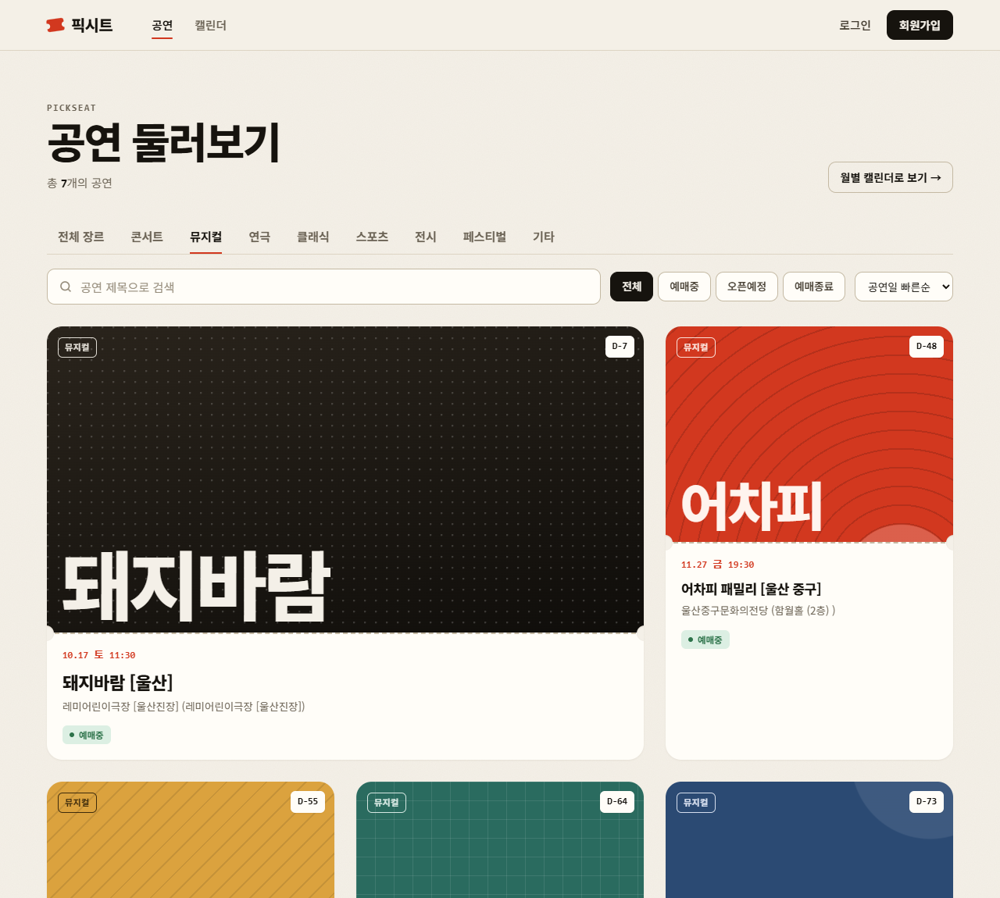
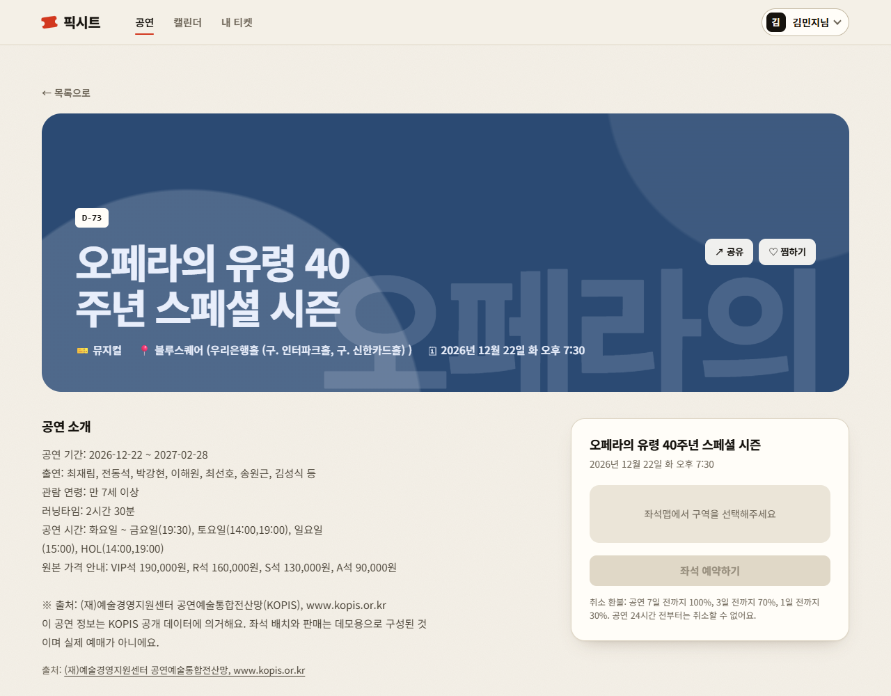
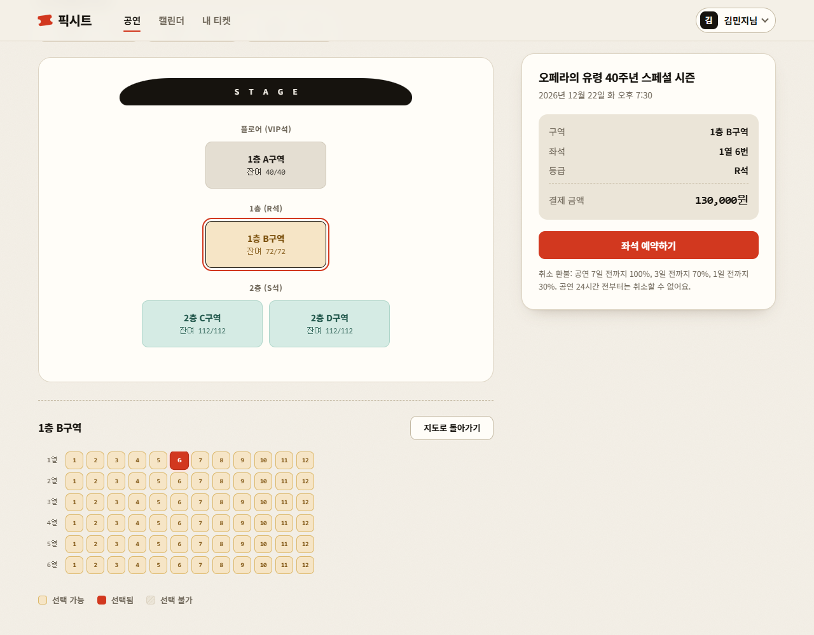
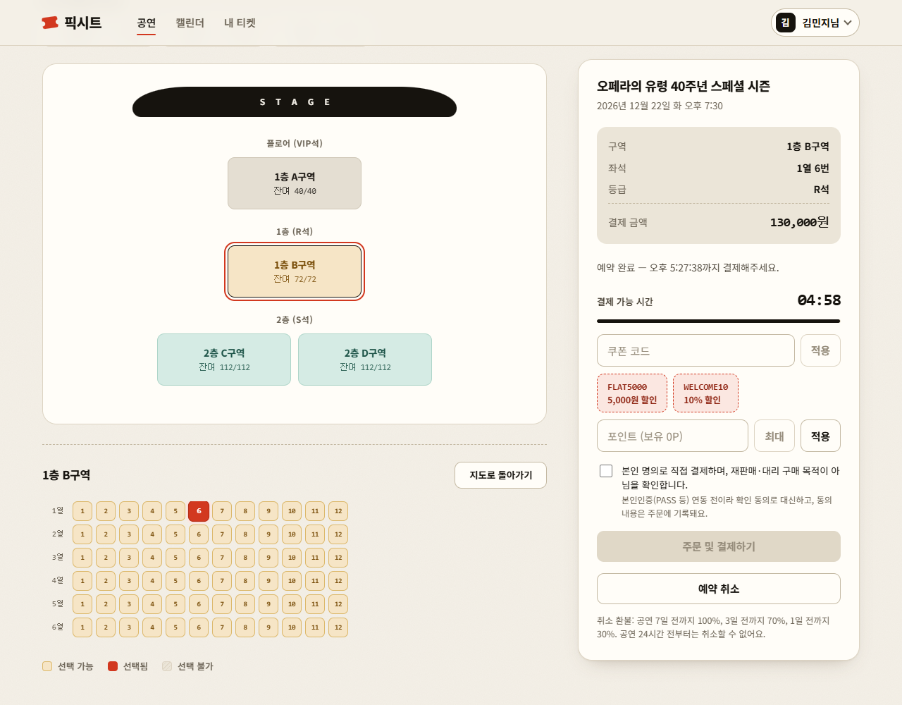
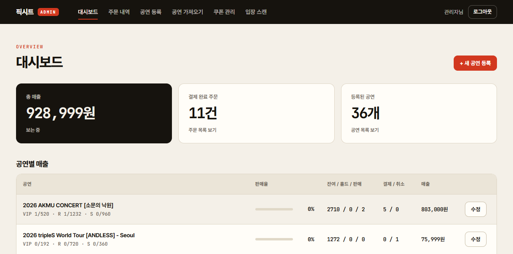
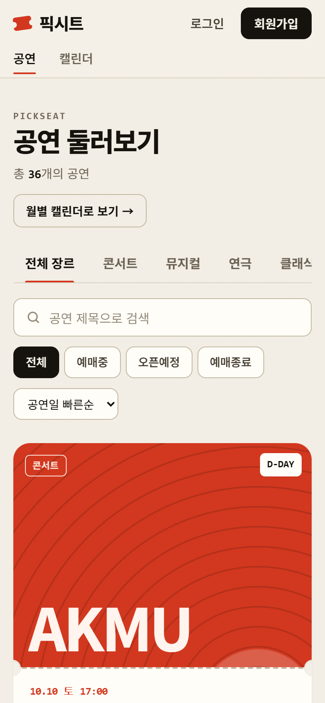
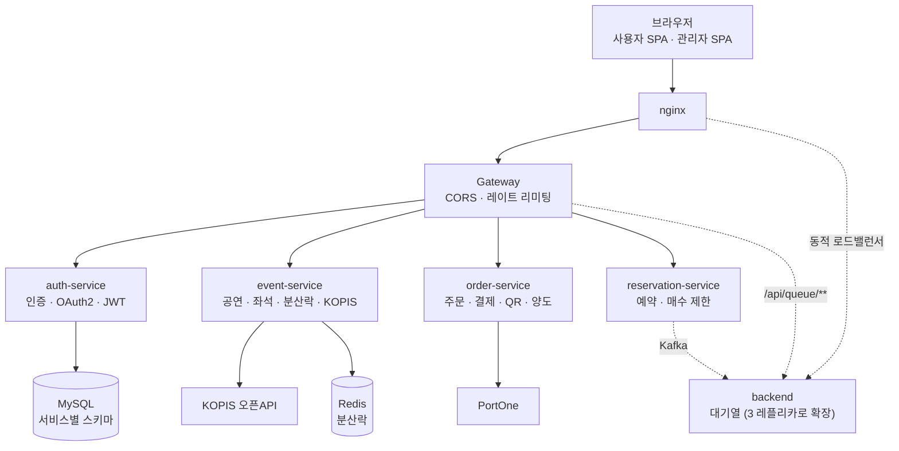
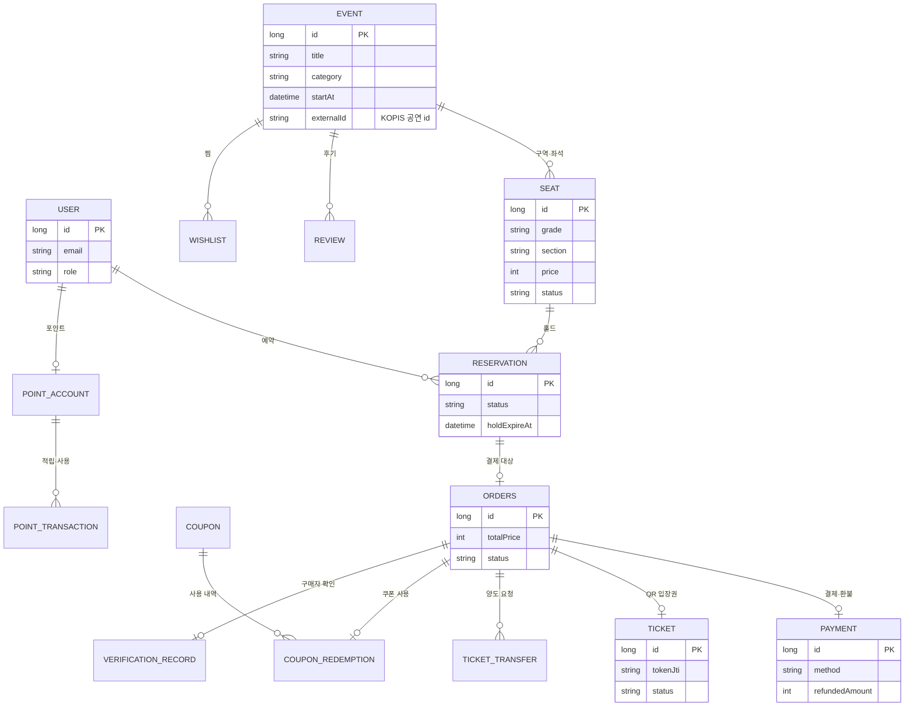

# 픽시트 (PickSeat)

> 먼저 잡는 사람이 앉는 자리 — **선착순 공연 티켓팅 서비스**


## 목차

1. [개요](#1-개요)
2. [기술 스택](#2-기술-스택)
3. [화면](#3-화면)
4. [중요 기술 및 기능](#4-중요-기술-및-기능)
5. [도메인](#5-도메인)
6. [프로젝트 구조](#6-프로젝트-구조)
7. [실행 방법](#7-실행-방법)
8. [환경변수](#8-환경변수)
9. [문서](#9-문서)

## 1. 개요

콘서트·연극·뮤지컬처럼 한정된 좌석에 사용자가 한꺼번에 몰리는 상황을 가정한 티켓팅 서비스입니다. 단일 모놀리스로 시작해
**동시성 제어 → 수평 확장 → 마이크로서비스 분리**를 단계적으로 겪으며 확장했고, 설계를 바꿀 때마다 k6 부하테스트로 전후 수치를 비교했습니다.
이후 "예매가 되는 서비스"에서 **"운영할 수 있는 서비스"** 로 넓혀 QR 입장권, 쿠폰·포인트, 단계별 환불, 티켓 양도, 알림, 관리자 도구,
봇 방어를 기능 단위 브랜치와 PR로 하나씩 더했습니다. 공연 정보는 공공데이터(KOPIS)에서 가져오고, 화면은 "인쇄된 티켓" 컨셉으로 디자인했습니다.

- **개인 프로젝트**로 기획, 설계, 개발, 테스트까지 진행했습니다.
- 가져온 공연은 **데모 예매**입니다. 결제는 PortOne 테스트 환경이라 실제 금액이 청구되지 않습니다.

## 2. 기술 스택

### Frontend


### Backend


### Infra / DevOps


### 외부 연동


## 3. 화면

| 공연 목록 (장르 탭 · 포스터 카드) | 공연 상세 (KOPIS 출처 표기) |
|:---:|:---:|
|  |  |
| **좌석 선택 (구역 → 좌석)** | **좌석 홀드 5분 타이머 · 쿠폰 · 포인트** |
|  |  |
| **관리자 대시보드** | **모바일** |
|  |  |

관리자 앱의 [KOPIS 공연 가져오기](docs/images/06-admin-import.png) 화면도 있습니다.

## 4. 중요 기술 및 기능

### 아키텍처



서비스별 역할과 라우팅, 봇 방어 설정은 [`docs/architecture.md`](docs/architecture.md)에 있습니다.

### 핵심 기술

| 문제 | 해결 |
|---|---|
| 같은 좌석을 동시에 잡는 경쟁 | Redisson 분산락 + 좌석 상태 확인을 한 임계 구역에서 처리 (동시 30건에도 중복 예약 0건) |
| 사용자가 한꺼번에 몰림 | 선착순 **대기열**, 수평 확장한 backend 3개로 분산, nginx 연결 재사용으로 실패율 24% → 0.05% (기능 확장 이전 구조 기준) |
| 결제·환불·쿠폰·포인트 정합성 | 조건부 `UPDATE`로 원자적 처리, PortOne 결제를 서버에서 재검증, 환불액을 서버가 계산해 확인 후 취소 |
| 같은 QR을 두 번 스캔 | `UPDATE … WHERE status='ISSUED'` 한 문장으로 전이해 한 건만 성공 |
| 봇의 로그인 대입·좌석 선점 | IP별 토큰 버킷 레이트 리미팅 + reCAPTCHA (검증 서버 장애 시 통과시키지 않음) |
| 시크릿 노출·토큰 위조 | JWT·QR 시크릿 기본값 제거(없거나 32바이트 미만이면 기동 거부), 관리자 토큰 분리·15분 단명 |
| 메일 서버 지연·장애 | 커밋 이후 비동기 발송, 실패해도 결제·예약 흐름 유지 |
| 실제 공연 데이터 | KOPIS 공공데이터 연동 (이용 조건 준수: 호출 간격 제한, 출처 표기, XXE 방어) |

설계 이유와 검증 방법은 [`docs/design-notes.md`](docs/design-notes.md)에 정리했습니다.
동시성이 걸린 로직은 mock이 아니라 실제 MySQL에 붙는 통합 테스트로 검증하고, 테스트 메서드는 총 115개입니다.

### 주요 기능

- **예매 흐름**: 대기열 → 좌석 선택(5분 임시 보관, 공연당 1인 4석) → 쿠폰·포인트 → 결제, 결제대기 주문 이어서 결제
- **결제·환불**: PortOne 카드·간편결제, 공연 7일 전 100% / 3일 전 70% / 1일 전 30% 단계별 환불
- **내 티켓**: 입장권(QR)과 주문 내역을 한 화면에서 확인, 티켓 양도(티켓당 1회)
- **알림**: 가입 인증, 공연 전날 리마인더, QR 발급, 오픈 알림, 취소표 알림 (HTML 메일)
- **탐색**: 장르 필터, 월별 캘린더, 찜, 후기·별점
- **관리자 앱**: 공연·좌석 관리, 판매 대시보드, 주문 조회, 쿠폰 발행, QR 입장 스캔, **KOPIS 공연 가져오기**
- **화면**: "인쇄된 티켓" 컨셉의 디자인 시스템(토큰·타이포·포스터 생성·접근성·반응형)

기능별 상세는 [`docs/features.md`](docs/features.md)를 참고하세요.

## 5. 도메인

서비스마다 DB 스키마를 따로 두고, 서비스 간 참조는 FK가 아니라 **id 값 + REST 호출**로만 합니다(점선 관계는 서비스 경계를 넘는 참조).



| 서비스 | 도메인 |
|---|---|
| auth-service | User(이메일·소셜 계정, 역할), NotificationPreference |
| event-service | Event, Seat, Review, Wishlist, OpenAlertSubscription, WaitlistSubscription |
| reservation-service | Reservation (좌석 홀드·확정·만료·취소) |
| order-service | Orders, Payment, Ticket, TicketTransfer, Coupon, CouponRedemption, PointAccount, PointTransaction, VerificationRecord |
| backend | WaitingQueue (대기열) |

## 6. 프로젝트 구조

```
ticketing-service/
├─ gateway/               # API Gateway (라우팅 · CORS · 레이트 리미팅)
├─ auth-service/          # 인증 · OAuth2 · JWT 발급
├─ event-service/         # 공연 · 좌석 · 후기 · 알림 · 분산락 · KOPIS 가져오기
├─ reservation-service/   # 예약 · 매수 제한 · 만료 스윕
├─ order-service/         # 주문 · 결제 · 쿠폰/포인트 · QR · 양도
├─ backend/               # 대기열 (수평 확장 대상)
├─ nginx/                 # 외부 진입점 + backend 내부 로드밸런서
├─ frontend/              # 사용자 SPA (:5173)
├─ admin-frontend/        # 관리자 SPA (:5174, 일반 사이트와 origin·토큰·로그인 분리)
├─ loadtest/              # k6 부하테스트 스크립트
├─ docs/                  # 기능 상세 · 아키텍처 · 설계 노트 · 기획 문서
└─ docker-compose.yml     # 로컬 전체 스택
```

## 7. 실행 방법

필요한 것: Docker Desktop, Node.js 20.19 이상 (Vite 8 요구사항)

```bash
# 1. 환경변수 준비 (아래 '환경변수' 참고, 최소 JWT_SECRET·QR_TOKEN_SECRET 필수)
cp .env.example .env
cp frontend/.env.example frontend/.env

# 2. 백엔드 전체 기동 (MySQL, Redis, Kafka, nginx, gateway, 5개 서비스)
docker compose up -d

# 3. 사용자 앱 → http://localhost:5173
cd frontend && npm install && npm run dev

# 4. 관리자 앱 → http://localhost:5174 (선택)
cd admin-frontend && npm install && npm run dev
```

- API 진입점은 nginx 하나입니다: `http://localhost:8080`
- 관리자 계정은 일반 가입 후 DB에서 승격합니다: `UPDATE users SET role='ADMIN' WHERE email='...'` → 관리자 앱에서 로그인
- 로그 확인: `docker compose logs -f gateway reservation-service`
- 서비스 중지: `docker compose stop` (다시 켜기: `docker compose up -d`)
- 부하테스트 방법은 [`docs/design-notes.md`](docs/design-notes.md#부하테스트-실행)에 있습니다.

## 8. 환경변수

### 루트 `.env` (백엔드)

| 변수 | 필수 | 설명 |
|---|:---:|---|
| `JWT_SECRET` | ✅ | 로그인 토큰 서명·검증. 모든 서비스가 같은 값, 32바이트 이상 |
| `QR_TOKEN_SECRET` | ✅ | 입장 QR 서명(order-service). `JWT_SECRET`과 다른 값 권장 |
| `GOOGLE_CLIENT_ID` / `GOOGLE_CLIENT_SECRET` | | Google 로그인 |
| `KAKAO_CLIENT_ID` / `KAKAO_CLIENT_SECRET` | | 카카오 로그인 |
| `MAIL_USERNAME` / `MAIL_PASSWORD` | | Gmail SMTP(앱 비밀번호). 인증·알림 메일 |
| `PORTONE_STORE_ID` / `PORTONE_CHANNEL_KEY` / `PORTONE_API_SECRET` | | PortOne 테스트 결제 |
| `RECAPTCHA_SECRET_KEY` | | reCAPTCHA v2 서버 키. 비우면 캡차 없이 동작 |
| `KOPIS_SERVICE_KEY` | | KOPIS 오픈API 키. 비우면 공연 가져오기 비활성 |
| `RESERVATION_MAX_SEATS_PER_EVENT` | | 공연당 1인 최대 좌석 수 (기본 4) |

시크릿 값은 `openssl rand -base64 48` 또는 `node -e "console.log(require('crypto').randomBytes(48).toString('base64'))"`로 만드세요.
기본값이 없어서 비어 있으면 서비스가 기동을 거부합니다. 선택 항목을 비워 두면 해당 기능만 빠집니다.

### `frontend/.env` (사용자 앱)

| 변수 | 설명 |
|---|---|
| `VITE_API_BASE_URL` | API 주소 (기본 `http://localhost:8080/api`) |
| `VITE_BACKEND_ORIGIN` | OAuth 리다이렉트용 서버 주소 |
| `VITE_PORTONE_STORE_ID` / `VITE_PORTONE_CHANNEL_KEY` | 결제창 |
| `VITE_PORTONE_CHANNEL_KEY_KAKAOPAY` / `_NAVERPAY` | 간편결제 (넣은 것만 노출) |
| `VITE_RECAPTCHA_SITE_KEY` | reCAPTCHA 사이트 키 |
| `VITE_CONTACT_EMAIL` | 문의하기 페이지에 표시할 이메일 |

### 실행 시 스위치

| 변수 | 설명 |
|---|---|
| `RATE_LIMIT_ENABLED` | `false`면 게이트웨이 레이트 리미팅 끔 (부하테스트용) |
| `CAPTCHA_ENABLED` | `false`면 서버 캡차 검증 끔 |
| `IDENTITY_VERIFICATION_REQUIRED` | 결제 전 구매자 확인 필수 여부 (기본 true) |
| `QUEUE_ACTIVE_CAPACITY` / `QUEUE_ADMISSION_INTERVAL_MS` | 대기열 동시 입장 수 / 입장 간격 |

## 9. 문서

| 문서 | 내용 |
|---|---|
| [기능 상세](docs/features.md) | 기능별 동작·규칙, KOPIS 연동, 디자인 시스템 |
| [아키텍처](docs/architecture.md) | 서비스 구성, 게이트웨이 라우팅, 봇 방어 설정 |
| [설계 노트](docs/design-notes.md) | 설계 포인트, 부하테스트(재측정 포함), 테스트, 알려진 한계 |
| 기획 문서 | 요구사항 정의서, 엔티티 설계서, API 명세서, OAuth2 설정 정리 (`docs/*.docx`) |
