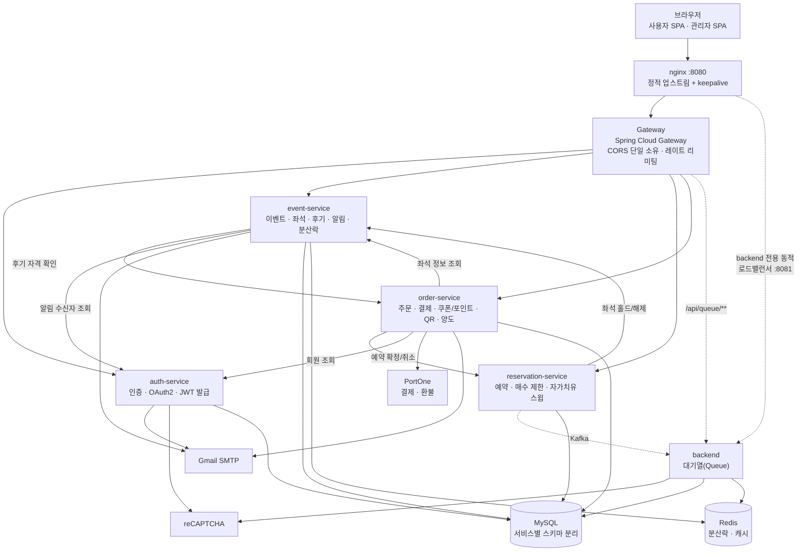

# 아키텍처 · 서비스 구성

> 요약은 [README](../README.md#아키텍처)에 있습니다.

## 아키텍처

**입구는 nginx 하나뿐입니다.** nginx가 Gateway로 가는 경로는 고정 IP + 커넥션 풀링(`keepalive`)으로 연결하고,
수평 확장되는 `backend`로 가는 경로만 별도 포트(8081)에서 동적 DNS resolver로 매 요청마다 살아있는 레플리카를
다시 찾습니다 — 이렇게 나눈 이유는 [부하테스트 결과](./design-notes.md#부하테스트로-검증한-것들)에 있습니다. CORS는 Gateway
한 곳에서만 처리합니다(개별 서비스가 각자 CORS를 설정하면 헤더가 중복으로 붙어 브라우저가 응답을 거부합니다).

## 서비스 구성

| 서비스 | 역할 | 비고 |
|---|---|---|
| `gateway` | 단일 진입점, 라우팅, CORS, IP별 레이트 리미팅 | Spring Cloud Gateway (함수형 `RouterFunction` 기반) |
| `auth-service` | 회원가입/로그인, 이메일 인증, OAuth2(Google/Kakao), 관리자 로그인, 알림 수신 설정, JWT 발급 | JWT를 **발급**하는 유일한 서비스 |
| `event-service` | 이벤트/좌석, 장르·캘린더 조회, 찜·후기, 오픈/취소표 알림, 관리자 공연·좌석 관리, KOPIS 공연 가져오기 | Redis(Redisson) 분산락으로 동시 홀드 방지 |
| `reservation-service` | 좌석 예약, 예약 확정/취소, 공연당 매수 제한 | 홀드 만료를 스스로 정리하는 자가치유 스윕 보유 |
| `order-service` | 주문, PortOne 결제/단계별 환불, 쿠폰·포인트, QR 입장권, 티켓 양도, 구매자 확인, 관리자 매출 집계·주문 조회 | 결제 실패 시 예약 자동 취소(saga) |
| `backend` | 대기열(Queue) 입장/상태 조회 | 3개 레플리카로 수평 확장되는 유일한 서비스 |
| `nginx` | 외부 진입점, 내부 로드밸런서 | `backend` 전용 동적 로드밸런싱 포트(8081) 별도 운영 |
| `mysql` / `redis` / `kafka` | 데이터 저장소 · 메시징 | 서비스마다 스키마(`ticketing_auth`, `ticketing_event` 등) 분리 |

각 서비스는 자신의 DB 스키마만 소유하며, 서비스 간 참조는 전부 `Long` id + 전용 REST 클라이언트로 이뤄집니다.
JWT는 auth-service만 발급하고(`sub`, `email`, `role` 클레임), 나머지 서비스는 같은 시크릿으로 검증만 하며 `role`을
`ROLE_USER` / `ROLE_ADMIN` 권한으로 바꿉니다. 권한 검사는 서비스별 `SecurityConfig`의 URL 매처(`hasRole("ADMIN")`)로 합니다.

## 봇 방어 (레이트 리미팅)

게이트웨이가 클라이언트 IP별 토큰 버킷으로 요청을 제한합니다(`gateway/.../ratelimit`, 설정은 `application.yml`의 `rate-limit`). 버스트는 허용하고 지속적인 과다 요청만 `429 TOO_MANY_REQUESTS`(+ `Retry-After`)로 막습니다.

| 대상 | 제한 |
|---|---|
| 관리자 로그인 | 분당 5회 |
| 로그인 / 회원가입 | 분당 10회 / 5회 |
| 인증 메일 재발송 | 분당 3회 |
| 대기열 진입 / 좌석 홀드 | 분당 20회 / 20회(버스트 10) |
| 대기열 상태 조회(2초 폴링) | 분당 120회, 전체 제한과 별도 |
| 쿠폰 적용 / 티켓 양도 | 분당 10회 / 5회 (코드·이메일 추측 방지) |
| 그 외 `/api/**` | 분당 600회 |

- IP는 nginx가 덮어쓰는 `X-Real-IP`를 신뢰합니다(게이트웨이는 nginx를 거쳐서만 접근 가능).
- 버킷은 게이트웨이 메모리에 있어 단일 인스턴스 기준입니다. 게이트웨이를 여러 대로 늘리면 Redis 같은 공유 저장소로 옮겨야 합니다.
- 학교·회사처럼 한 IP를 여러 명이 쓰는 환경에서는 제한에 걸릴 수 있어 기본값을 넉넉히 잡았습니다.
- 캡차(reCAPTCHA v2 체크박스)는 **로그인**과 **대기열 진입**에 붙어 있습니다. 브라우저가 받은 토큰을 서버(auth-service, backend)가 구글 siteverify로 확인하고, 구글에 연결할 수 없으면 통과시키지 않고 거절합니다(fail closed). 대기열 상태 조회와 이후 좌석 홀드는 이미 대기열을 통과한 사용자라 따로 걸지 않았습니다.
- 키는 `.env`의 `RECAPTCHA_SECRET_KEY`(서버)와 `frontend/.env`의 `VITE_RECAPTCHA_SITE_KEY`(공개 사이트 키)입니다. 둘 다 비워두면 캡차 없이 동작합니다.

## API 게이트웨이 라우팅

| 경로 | 대상 서비스 |
|---|---|
| `/api/auth/**`, `/oauth2/**`, `/login/oauth2/**` | auth-service |
| `/api/events/**` (관리자용 `/api/events/admin/**` 포함) | event-service |
| `/api/wishlist/**` | event-service |
| `/api/reservations/**` | reservation-service |
| `/api/orders/**` (쿠폰·포인트·티켓·양도 포함) | order-service |
| `/api/admin/**` (QR 스캔, 쿠폰 발행, 매출 집계, 주문 목록) | order-service |
| `/api/queue/**` | backend (nginx 내부 로드밸런서 경유) |
